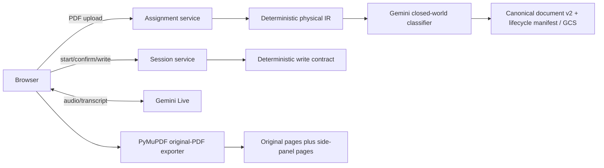
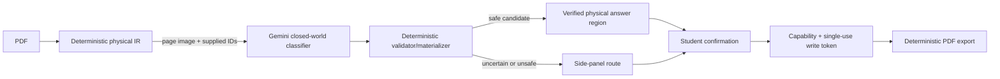

# Claros architecture

## Product boundary

Claros helps a student understand a structured worksheet, propose an answer,
and write it into the original PDF only after that student explicitly confirms
the answer. Normal use has no teacher or human-adjudication dependency.

Supported documents have reproducible physical evidence: PDF pages, point
dimensions, source blocks, reading order, and supplied response candidates.
Uncertain or unsafe placements route to a deterministic side panel.

## Authority boundary

| Owner | May decide | Must not decide |
| --- | --- | --- |
| Gemini semantic classifier (default document path) | Page role, task grouping, and selection of supplied source blocks/response candidates | Coordinates, source text, IDs, confirmation, authorization, PDF changes, overflow, or side-panel rendering |
| Gemini Live | Audio transport, speech recognition/output, turn detection, interruption, transcript delivery | Document semantics, geometry, confirmation, authorization, PDF changes, or security decisions |
| Deterministic application code | Physical IR, stable IDs, coordinate and relationship validation, side-panel routing, student confirmation, capabilities, write tokens, export and PDF modification | Model-authored semantics outside supplied evidence |
| Student | Confirmation of the exact proposed answer; optional safe correction | Arbitrary unvalidated write coordinates |

## Current verified runtime

The checked-in default builds a deterministic physical IR, then uses Gemini
for closed-world document semantics. Gemini Live provides the optional voice
path. No OpenAI provider is part of this runtime.

## Target document path

The physical IR uses PyMuPDF's unrotated extraction coordinate frame, a
top-left origin, and `[x0, y0, x1, y1]` boxes. For ordinary pages that is the
PDF point frame; crop and `/UserUnit` behavior is retained in the page's
extraction dimensions instead of being silently mixed with display bounds. The
compiler may select existing IDs only; code reconstructs prompt text from
ordered source blocks and derives geometry only from validated candidates.

## Canonical document contract

One versioned `IntermediateDocument` is the persisted source of truth for a
worksheet. It contains document identity, pages and roles, source blocks,
stable tasks with explicit order and parent/subpart relations, structured
choices, and independently identified response regions. A task links to zero,
one, or many regions; each link has a role such as answer, explanation, show
work, or choice. A task with no safe physical target carries an explicit
side-panel fallback.

An approved response region is fully contained in one eligible physical
`response_area` source block. Response sources cannot be reused, approved
regions cannot overlap in their interiors, and visible prompts and choices are
reconstructed from source blocks rather than model-authored labels. Extraction
clips or omits evidence outside its page frame; a clipped response candidate is
not writable.

`rotation`, non-default crop, or `/UserUnit` scale marks a page as requiring a
display transform. Until an explicit deterministic transform exists, native
physical targets on such pages are unsafe and route to the side panel. Paddle
OCR geometry on those pages is omitted; any retained OCR text is semantic
evidence only, never a physical target.

The browser receives a safe projection of that document. Normalized browser
rectangles are derived only at this API boundary; unsafe region geometry is not
sent to student clients. Historical flat `questions[]` manifests are migrated
in memory to the canonical contract as quarantined legacy evidence. They do
not become a second persisted production model.

Session state is separate and mutable. It is keyed by canonical task and
response-target IDs, records drafts/confirmation/tokens/writes, and binds every
write token and export check to a snapshot of the specific target. The legacy
numeric question ID is only a temporary request-boundary alias and is never
used as document identity.

Before any client projection, page preview, session configuration, or review
can expose canonical physical evidence, the stored PDF is bound to the
canonical document by SHA-256, page count, extraction-frame dimensions,
rotation, and transform requirement. A mismatch returns an intentional source
mismatch error rather than showing or approving stale geometry.

## Safety and data controls

- Assignment capabilities are required for sensitive assignment actions in the
  target P0/P1 design. They are high-entropy browser-held secrets stored only as
  keyed hashes server-side, never URLs.
- Confirmation state and written answers are server-authoritative for export.
  The confirmed answer is carried unchanged through its answer-bound write token
  and Unicode-capable PDF renderer; unsupported text fails explicitly rather
  than being silently substituted.
- Export validates task snapshots and renders from that same in-process manifest
  snapshot, so a concurrent review edit cannot redirect a previously confirmed
  answer to a different task or region.
- Model/provider operational logs exclude worksheet/transcript content by
  default; telemetry uses hashes, latency, cost, and reason codes.
- Upload, provider-session, durable-session, write, mutation, preview, and
  debug-provider routes use bounded in-process sliding-window limits. They are
  prototype safeguards, not a distributed production WAF.
- Expiration and physical deletion are different. Storage lifecycle behavior is
  documented rather than claimed until verified.

## Evaluation boundary

The reliability package is an AI-adjudicated silver benchmark, not human gold.
It reports agreement, adjudication/abstention, validation failures, safety,
latency, and cost. Any F1 is explicitly provisional silver-relative agreement.
