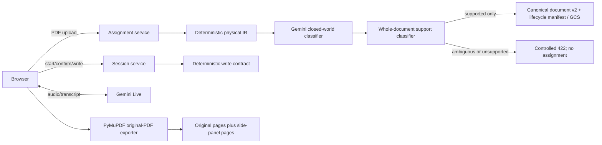
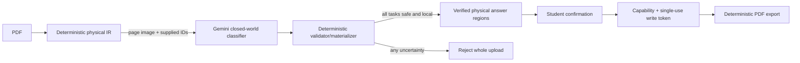

# Claros architecture

## Product boundary

Claros helps a student understand a sequential short-answer worksheet, propose an answer,
and write it into the original PDF only after that student explicitly confirms
the answer. Normal use has no teacher or human-adjudication dependency.

Supported documents have reproducible physical evidence and exactly one local
answer destination directly below every question on the same page. The
production `parse_supported_worksheet` boundary rejects the entire upload when
the layout is uncertain, unsupported, or exceeds its workload ceiling. A side
panel may handle only answer overflow after an approved target exists.

## Authority boundary

| Owner | May decide | Must not decide |
| --- | --- | --- |
| Gemini semantic classifier (default document path) | Page role, task grouping, and selection of supplied source blocks/response candidates | Coordinates, source text, IDs, confirmation, authorization, PDF changes, overflow, or side-panel rendering |
| Gemini Live | Audio transport, speech recognition/output, turn detection, interruption, transcript delivery | Document semantics, geometry, confirmation, authorization, PDF changes, or security decisions |
| Deterministic application code | Physical IR, stable IDs, source-visibility and relationship validation, persisted-manifest integrity, side-panel routing, student confirmation, capabilities, write tokens, export and PDF modification | Model-authored semantics outside supplied evidence |
| Student | Confirmation of the exact proposed answer; optional safe correction | Arbitrary unvalidated write coordinates |

## Current verified runtime

The checked-in default builds a deterministic physical IR, then uses Gemini
for closed-world document semantics. Gemini Live provides the optional voice
path. Browser voice code isolates provider transport
(`frontend/voice-live-transport.js`) from transcript-to-product events
(`frontend/voice-product-bridge.js`); confirmation and write remain
server-gated. No OpenAI provider is part of this runtime.

## Target document path

The physical IR uses PyMuPDF's unrotated extraction coordinate frame, a
top-left origin, and `[x0, y0, x1, y1]` boxes. For ordinary pages that is the
PDF point frame; crop and `/UserUnit` behavior is retained in the page's
extraction dimensions instead of being silently mixed with display bounds. The
compiler may select existing IDs only; code reconstructs prompt text from
ordered source blocks and derives geometry only from validated candidates.

## Canonical document contract

`parse_document` remains the lower-level physical and evaluation pipeline.
Production assignment creation calls only `parse_supported_worksheet`, which
adds a versioned whole-document classification and workload accounting. A
rejected document is never persisted as a writable assignment.

The supported contract is limited to at most 8 pages, 40 questions, and 8
semantic-provider page calls. Each provider request has a 15-second timeout and
one attempt. Question-to-answer mapping must be same-page, below the prompt,
physically ordered, and unambiguous. Choices, tables, complex columns, essays,
drawing/show-work tasks, answer keys, scans/OCR-only targets, transformed
geometry, extra unclaimed writable spaces, and remote answer sections reject.

One versioned `IntermediateDocument` is the persisted source of truth for an
accepted worksheet. It contains document identity, pages and roles, source blocks,
stable tasks with explicit order and parent/subpart relations, structured
choices, and independently identified response regions. A task links to zero,
one, or many regions; each link has a role such as answer, explanation, show
work, or choice. A task with no safe physical target may exist in lower-level
evaluation output, but cannot cross the production acceptance boundary.

An approved response region is fully contained in one eligible physical
`response_area` source block. Response sources cannot be reused, approved
regions cannot overlap in their interiors, and visible prompts and choices are
reconstructed from source blocks rather than model-authored labels. Extraction
clips or omits evidence outside its page frame; a clipped response candidate is
not writable.

For current PDF-coordinate documents, an approved response source must be
native `pdf_geometry`; OCR layout output is semantic evidence only and cannot
become a write target. The quarantined normalized-legacy adapter retains its
own legacy-parser provenance only for compatibility with already-normalized
records. The physical extractor derives stable geometry IDs from page/type/
coordinates, uses actual glyph bounds for underscore blanks, distinguishes
typed form widgets and checkbox controls, and recognizes standalone vector
boxes without treating grids or decorative rules as writable. Candidate work is
bounded before vector reconstruction; a page over the deterministic vector
budget contributes no partial vector write evidence.

Native text can authorize a current write only when its glyphs are fully opaque
and visibly contrasted in a deterministic page render. Text intersecting a
vector graphic or image is excluded rather than guessed at; this rejects hidden
text layers, near-transparent/white text, and graphic-overlapped content.
Typed fields, underscore blanks, vector boxes, and vector lines are likewise
excluded when their proposed writable interiors contain printed text, graphics,
or a choice-like control. A deterministic source cue for a teacher guide,
answer key, or no-write page makes the production document unsupported even if
semantic output otherwise calls it student-facing.

Task-to-region association is validated deterministically after the semantic
classifier selects supplied IDs: a target must be on the same page, not overlap
prompt text (except an explicit underscore run), and cannot skip a competing
numbered prompt. A task may use multiple physical areas only when their roles
are deterministic (answer plus explicit show-work/explanation) in lower-level
evaluation; multi-role tasks are outside the production contract. Ambiguous,
cross-page, OCR-only, clipped, table-grid, and unsupported relationships reject
the production upload. Choice labels are
preserved as source-backed `DocumentChoice` records. Checkboxes remain
selection evidence and side-panel-only until a deterministic PDF mark renderer
exists; neither the review path nor the exporter may turn one into a text
overlay.

`rotation`, non-default crop, or `/UserUnit` scale marks a page as requiring a
display transform. Until an explicit deterministic transform exists, native
physical targets on such pages make the production document unsupported. Paddle
OCR geometry on those pages is omitted; any retained OCR text is semantic
evidence only, never a physical target.

The browser receives a safe projection of that document. Normalized browser
rectangles are derived only at this API boundary; unsafe region geometry is not
sent to student clients, and checkbox controls are never advertised as text
write targets. Historical flat `questions[]` manifests are migrated
in memory to the canonical contract as quarantined legacy evidence. They do
not become a second persisted production model.

Safe projection and original-page export both require an accepted supported
worksheet, an approved task and region, explicit `student_worksheet` roles for
the task and page, a parsed
non-OCR page with reliable native evidence and no pending page review, plus a
local native task-shaped prompt (or directly adjacent colon-ended field label).
If any gate fails before assignment creation, the upload rejects. After
assignment creation, deterministic text overflow may use the labeled side
panel without changing the accepted task-to-region association.

Session state is separate and mutable. It is keyed by canonical task and
response-target IDs, records drafts/confirmation/tokens/writes, and binds every
write token and export check to a snapshot of the specific target. The legacy
numeric question ID is only a temporary request-boundary alias and is never
used as document identity.

Before any client projection, page preview, session configuration, or review
can expose canonical physical evidence, the stored PDF is bound to the
canonical document by SHA-256, page count, extraction-frame dimensions,
rotation, and transform requirement. A mismatch returns an intentional source
mismatch error rather than showing or approving stale geometry.

Persisted manifests that contain physical response links also carry a
domain-separated HMAC derived from the server-only session HMAC secret. The tag
binds the complete manifest payload and its storage assignment ID, and is
verified before loading it for client projection, review, or export. A changed,
swapped, or unsigned physical-target manifest is rejected; older records with
no response links remain quarantined side-panel-only. Export independently
re-extracts the source page and requires exact current native prompt and
physical response evidence before drawing. It installs its Unicode font under
a fresh page-local resource alias so a worksheet-provided alias cannot replace
approved answer characters.

## Safety and data controls

- Assignment capabilities are required for sensitive assignment actions in the
  target P0/P1 design. They are high-entropy browser-held secrets stored only as
  keyed hashes server-side, never URLs.
- Confirmation state and written answers are server-authoritative for export.
  The confirmed answer is carried unchanged through its answer-bound write token
  and Unicode-capable PDF renderer; unsupported text fails explicitly rather
  than being silently substituted.
- Refresh restoration reissues a single-use write token for each
  confirmed-but-unwritten response target. `reauthorize-write` covers retry
  paths without forcing the student to retype. Token consume and written-mark
  persist in one step; a successful same-answer write retry is idempotent.
  Re-confirming a different answer invalidates outstanding tokens and clears
  any stale written text for that target.
- Assignment deletion removes registered session blobs (`session-*.ref`
  markers under the assignment prefix) so active-session credentials cannot
  outlive the worksheet source.
- Export validates task snapshots and renders from that same in-process manifest
  snapshot, so a concurrent review edit cannot redirect a previously confirmed
  answer to a different task or region.
- Model/provider operational logs exclude worksheet/transcript content by
  default; telemetry uses hashes, latency, cost, and reason codes.
- Upload, provider-session, durable-session, write, mutation, preview, and
  debug-provider routes use bounded in-process sliding-window limits. They are
  prototype safeguards, not a distributed production WAF.
- Expiration and physical deletion are different. Storage lifecycle behavior is
  documented rather than claimed until verified.

## Evaluation boundary

The reliability package is an AI-adjudicated silver benchmark; no human
adjudication is claimed.
It reports agreement, adjudication/abstention, validation failures, safety,
latency, and cost. Any F1 is explicitly provisional silver-relative agreement.

The initial deterministic parser milestone is separate:
`evaluation/canonical_v1` renders three first-party, selectable-text student
worksheets from a strict semantic source specification. The renderer captures
prompt and response geometry as it draws each PDF and emits stable task IDs,
page roles, typed response regions, and prompt-to-response relationships.
These deterministic expected labels require no manual Label Studio annotation.
Stage 3 acceptance requires running those fixtures through
`document_pipeline.parse_document` without altering expected outputs to match
parser behavior.

The 20-document external acceptance corpus and preserved 17-page pilot are
later real-world/stress suites. They remain available for broader layout, OCR,
packet, table, visual, and outside-context testing, but they are not gates for
the first milestone. The production boundary is evaluated separately in
`evaluation/worksheet_contract_v1`: the first-party short-answer document must
be accepted and the choice and multi-region documents must reject. Canonical
success must not be generalized to arbitrary real-world PDFs.
