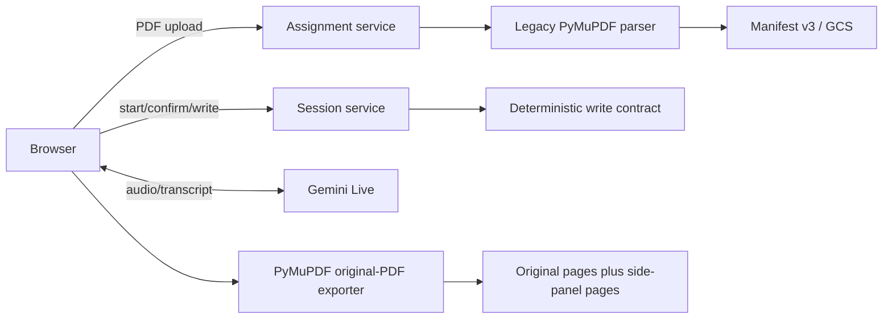
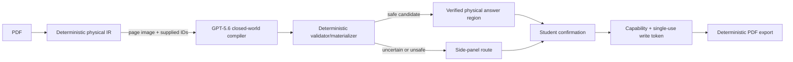

# Claros architecture

## Product boundary

Claros helps a student understand a structured worksheet, propose an answer,
and write it into the original PDF only after that student explicitly confirms
the answer. Normal use has no teacher or human-adjudication dependency.

Supported documents have reproducible physical evidence: PDF pages, point
dimensions, source blocks, reading order, and supplied response candidates.
Uncertain or unsafe placements route to a deterministic side panel.

## Authority boundary

| Owner | May decide | Must not decide |
| --- | --- | --- |
| GPT-5.6 semantic compiler (target) | Page role, task grouping, parent/subpart relationships, selection of supplied source blocks/response candidates, tutoring decisions | Coordinates, source text, IDs, confirmation, authorization, PDF changes, overflow, or side-panel rendering |
| OpenAI Realtime (target) | Audio transport, speech recognition/output, turn detection, interruption, transcript delivery | Document semantics, geometry, confirmation, authorization, PDF changes, or security decisions |
| Deterministic application code | Physical IR, stable IDs, coordinate and relationship validation, side-panel routing, student confirmation, capabilities, write tokens, export and PDF modification | Model-authored semantics outside supplied evidence |
| Student | Confirmation of the exact proposed answer; optional safe correction | Arbitrary unvalidated write coordinates |

## Current verified runtime

The checked-in default currently uses the legacy PyMuPDF parser and Gemini
Live. The OpenAI compiler and Realtime adapters are target architecture, not
current verified runtime behavior.

## Target document path

The physical IR uses PDF points, top-left origin, and `[x0, y0, x1, y1]`
boxes. The compiler may select existing IDs only; code reconstructs prompt text
from ordered source blocks and derives geometry only from validated candidates.

## Safety and data controls

- Assignment capabilities are required for sensitive assignment actions in the
  target P0/P1 design. They are high-entropy browser-held secrets stored only as
  keyed hashes server-side, never URLs.
- Confirmation state and written answers are server-authoritative for export.
- Model/provider operational logs exclude worksheet/transcript content by
  default; telemetry uses hashes, latency, cost, and reason codes.
- Expiration and physical deletion are different. Storage lifecycle behavior is
  documented rather than claimed until verified.

## Evaluation boundary

The reliability package is an AI-adjudicated silver benchmark, not human gold.
It reports agreement, adjudication/abstention, validation failures, safety,
latency, and cost. Any F1 is explicitly provisional silver-relative agreement.
